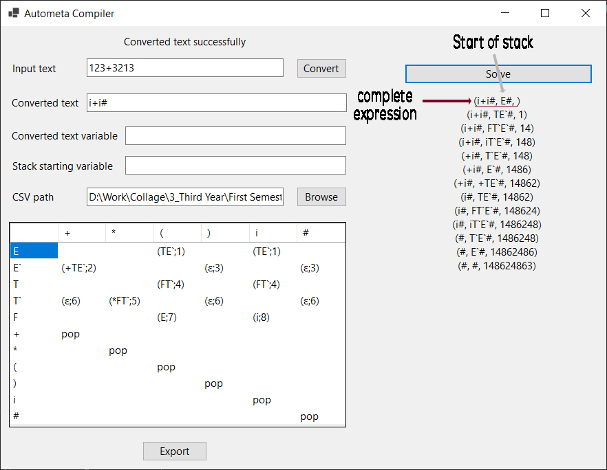

<h3 align="center">VSCode got nothing on me</h3>

[Description](#Description) •
[Functionalities](#Functionalities)

# Description

The app transfers an input of numbers only, to a one-digit variable expression, then read a CSV file that contains rules that help in reaching an end of stack that starts with symbol `E` and print the rule number, all of this in same line.

In short version, it is a basic compilers that checks if the sentence you input can have a proper output based on the rules you provide.

# Functionalities 
The app does the basic requirement but i added extra steps such as:
* Check if the Converted text variable exists in the column header of the CSV file
* Check if the stack starting variable exists in the row header of the CSV file
* You can Edit the cells and export the file.

# Emailware
CompilersAutometa is an [emailware](https://en.wiktionary.org/wiki/emailware). Meaning, if you liked using this app or it has helped you in any way, I'd like you send me an email at <ahmelsamahy@gmail.com> about anything you'd want to say about this software. I'd really appreciate it!

# License
If you have project similar to this which you will use this instead in it or you may use this project, don't forget to mention me or send me email about it.
